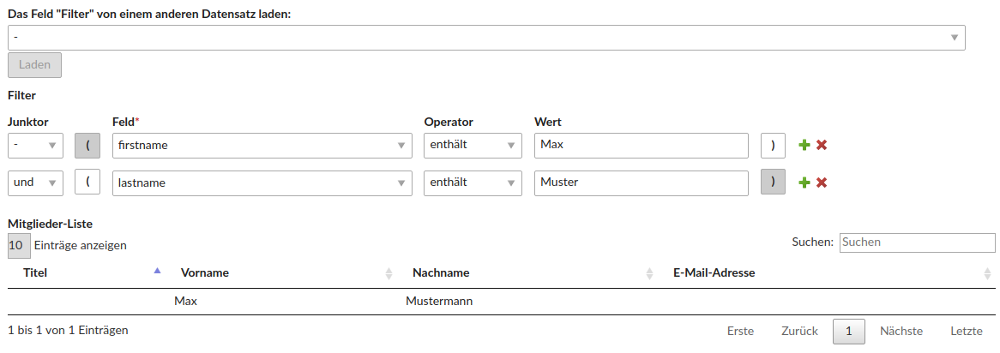

# Contao Entity Filter Bundle

This module offers an input type for selecting one or more entities by comfortably "clicking together" sql-like conditions.



## Features

- "click together" conditions for filtering (aka selecting) arbitrary contao entities
- load existing filter conditions from other records
- display a result list of your filtering right in the contao record's edit view

### Technical instructions

This module offers 3 comfortable different functions for adding the widgets mentioned before right to your dca.

_Note: Of course, you can also copy these 3 functions and customize them if they don't suit your needs_


#### Add the entity filter widget to your dca:

*Hint: If you like to set the table to be filtered dynamically, you can do that in an `onload_callback`.
But you still have to call the following function in your dca and not the callback because else `exclude` wouldn't be set correctly.* 

```
\Contao\System::getContainer()->get('huh.entity_filter.manager')->addFilterToDca(
    // the name of the field
    'memberConditions',
    // your dca
    'tl_md_recipient_list',
    // the table to be filtered
    'tl_member'
);
```

#### Add a field for copying entity filters from other records:

```
\Contao\System::getContainer()->get('huh.entity_filter.manager')->addFilterCopierToDca(
    // the name of the field
    'filterCopier',
    // your dca
    'tl_recipient_list',
    // the dca where the field values are situated you want to copy (usually the same as your dca)
    'tl_recipient_list',
    // the entity_filter field
    'memberConditions',
    // a custom options_callback -> if left out, ['huh.field_value_copier.util.field_value_copier_util', 'getOptions'] is used
    ['huh.field_value_copier.util.field_value_copier_util', 'getOptions'],
    // config parameters for field value copier widget
    [
        'labelPattern' => '%title% (ID %id%)'
    ]
);
```

#### Add a live-reloaded table for showing the results of your conditions:

```
\Contao\System::getContainer()->get('huh.entity_filter.manager')->addListToDca(
    // the name of the field
    'memberList',
    // your dca
    'tl_recipient_list',
    // the entity_filter field
    'memberConditions',
    // the table being filtered
    'tl_member',
    // the header fields of the table
    array(
        'title',
        'firstname',
        'lastname',
        'email',
    )
);
```

## Events

Name | Arguments
---- | ---------
`ModifyEntityFilterQueryEvent` | `string $table`, `string $field`, `$activeRecord`, `string $query`, `string $where`, `array $values`, `array $listDca`
